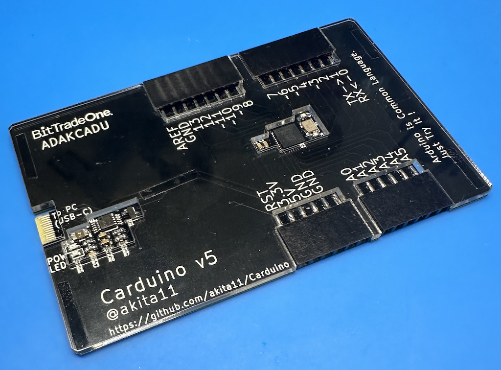
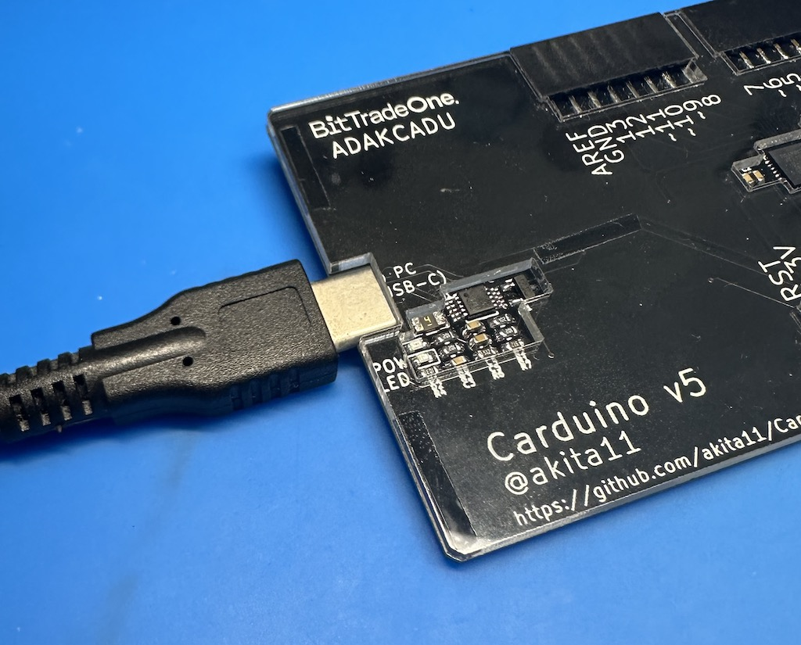

# Carduino_v5

Carduino_v5は、クレジットカードサイズ・厚さ2.5mmの、ArduinoUNO互換機です。
財布などにいつもいれておいて、いつでもその場でArduinoを使うことができます。
「Arduinoは興味あるんだけど、まだ触ったことないんだよね」という人に会ったら、その場でArduinoを体験してもらいましょう。
* ArduinoIDEの導入からLチカまでの手順は、本体裏面にシルクで書かれています。
* 基板パターンを利用したUSB-Cコネクタを使って、USB Type-CケーブルでPCと接続することができます。
* Arduinoの入出力端子はメスソケットですので、ジャンパワイヤ等をさしてつかうこともできます。
* USB-シリアル変換には、WCH CH340Eを使っています。

# 使い方

本体裏面のシルクを参照してください。

* USB Type-Cケーブルを本体コネクタ部にさしこみます。

※裏面にブートローダ書き込み端子(AVR-ISP)とA6・A7が表面実装パッドとして引き出してあります

# 作者

Junichi Akita (akita@ifdl.jp, @akita11)
